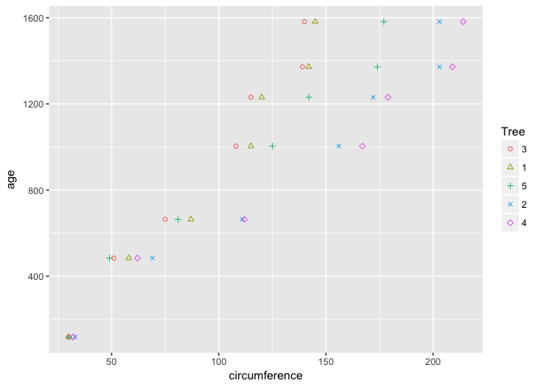
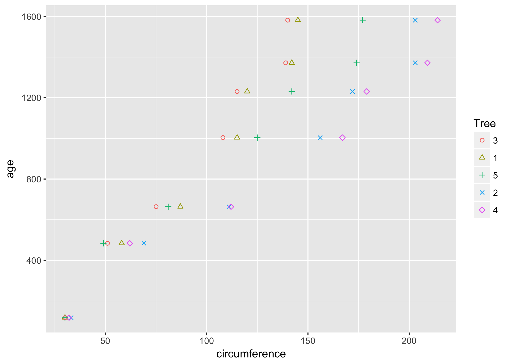
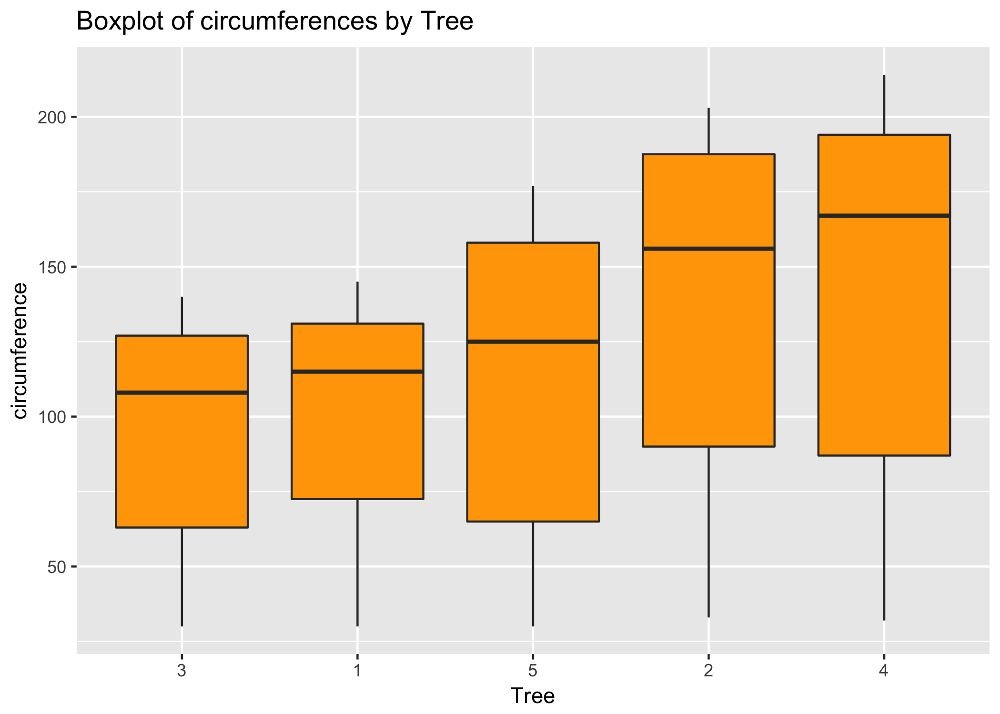
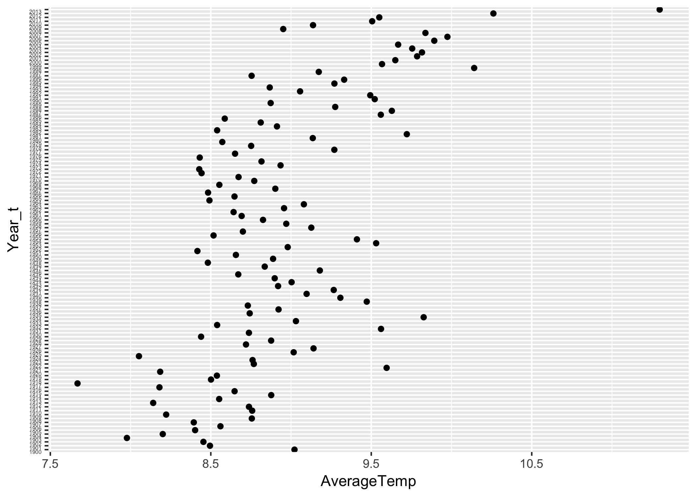

R Markdown
----------

The code for downloading, tyding data in a R Markdown file. The files
are included in a makefile format

    #downloading
    source("Download.R")

    #Cleaning
    source("Tyding.R")

Calculating the mean and median of the chunk circumferences for
different sizes of the trees

    #MEAN
    MeanTree<-tapply(Orange$circumference , Orange$Tree , FUN=mean,na.rm=T)
    MeanTree

    ##         3         1         5         2         4 
    ##  94.00000  99.57143 111.14286 135.28571 139.28571

    MeanTree = as.data.frame(as.table(MeanTree))

    MeanTree[1,]

    ##   Var1 Freq
    ## 1    3   94

    str(MeanTree)

    ## 'data.frame':    5 obs. of  2 variables:
    ##  $ Var1: Factor w/ 5 levels "3","1","5","2",..: 1 2 3 4 5
    ##  $ Freq: num  94 99.6 111.1 135.3 139.3

    #Changing the name of the columns
    colnames(MeanTree) <- c("Tree", "Average")
    str(MeanTree)

    ## 'data.frame':    5 obs. of  2 variables:
    ##  $ Tree   : Factor w/ 5 levels "3","1","5","2",..: 1 2 3 4 5
    ##  $ Average: num  94 99.6 111.1 135.3 139.3

    #convert Tree to numeric
    MeanTree$Tree<-as.numeric(MeanTree$Tree)

    #Sort the data
    MeanTree<-MeanTree[with(MeanTree, order(Tree)), ]
    MeanTree

    ##   Tree   Average
    ## 1    1  94.00000
    ## 2    2  99.57143
    ## 3    3 111.14286
    ## 4    4 135.28571
    ## 5    5 139.28571

    #MEDIAN

    MedianTree<-tapply(Orange$circumference , Orange$Tree , FUN=median,na.rm=T)
    MedianTree

    ##   3   1   5   2   4 
    ## 108 115 125 156 167

    MedianTree = as.data.frame(as.table(MedianTree))

    MedianTree[1,]

    ##   Var1 Freq
    ## 1    3  108

    str(MedianTree)

    ## 'data.frame':    5 obs. of  2 variables:
    ##  $ Var1: Factor w/ 5 levels "3","1","5","2",..: 1 2 3 4 5
    ##  $ Freq: num  108 115 125 156 167

    #Chaging the name of the columns
    colnames(MedianTree) <- c("Tree", "Median")
    str(MedianTree)

    ## 'data.frame':    5 obs. of  2 variables:
    ##  $ Tree  : Factor w/ 5 levels "3","1","5","2",..: 1 2 3 4 5
    ##  $ Median: num  108 115 125 156 167

    #convert Tree to numeric
    MedianTree$Tree<-as.numeric(MedianTree$Tree)

    #Sort the data
    MedianTree<-MedianTree[with(MedianTree, order(Tree)), ]
    MedianTree

    ##   Tree Median
    ## 1    1    108
    ## 2    2    115
    ## 3    3    125
    ## 4    4    156
    ## 5    5    167

Scatterplot of the TRUNK circumferences against the age of the tree.
Using different plotting symbols for different size of trees

    library(ggplot2)
    ggplot(Orange,aes(x=circumference, y=age, color=Tree, shape=Tree)) + geom_point() + scale_shape_manual(values=c(1,2,3,4,5))

    #Saving the plot in png format to be displayed in Github
    ggsave("Plot2b.png")

    ## Saving 7 x 5 in image

Displaying the trunk circumferences on a comparative boxplot against
tree.

    ggplot(Orange, aes(x=Tree,y=circumference )) + geom_boxplot(fill="orange") +ggtitle("Boxplot of circumferences by Tree")

    #Saving the plot in png format to be displayed in Github
    ggsave("Plot2c.png")

    ## Saving 7 x 5 in image

We will analyze the temperatures for countries and their corresponding
cities

    #calculate the MAXIMUM by COUNTRY
    #, Temp$City
    MaxCountry<-tapply(Temp$Monthly.AverageTemp , Temp$Country , FUN=max,na.rm=T)
    #MaxCountry[10]

    MaxCountry = as.data.frame(as.table(MaxCountry))

    #Chaging the name of the columns
    colnames(MaxCountry) <- c("Country", "MaxTemp")

    MinCountry<-tapply(Temp$Monthly.AverageTemp , Temp$Country , FUN=min,na.rm=T)

    MinCountry = as.data.frame(as.table(MinCountry))

    #Chaging the name of the columns
    colnames(MinCountry) <- c("Country", "MinTemp")

    # merge two data frames by City
    Diff_CountryTemp <- merge(MinCountry,MaxCountry,by="Country")

    #calculate differences
    Diff_CountryTemp$Diff<- Diff_CountryTemp$MaxTemp - Diff_CountryTemp$MinTemp

    #Sort the data
    Diff_CountryTemp<-Diff_CountryTemp[with(Diff_CountryTemp, order(-Diff)), ]

    #select the top 20
    Top20DiffCountry<-Diff_CountryTemp[1:20,]
    #Top20DiffCountry

The top 20 countries with the maximum monthly average temperatures since
1900 are:

    Top20DiffCountry[1:20,1]

    ##  [1] Kazakhstan   Mongolia     Russia       Canada       Uzbekistan  
    ##  [6] Turkmenistan Belarus      Finland      Estonia      Ukraine     
    ## [11] Kyrgyzstan   North Korea  Latvia       Moldova      Greenland   
    ## [16] Denmark      Lithuania    Tajikistan   Poland       Armenia     
    ## 238 Levels: Afghanistan Albania Algeria American Samoa Andorra ... Zimbabwe

Selecting a subset of US Temperatures and we the average monthly
temperature is calculated in Fahrenheit.

    #Select US temperatures from 01/01/1900

    UStemp<-subset(Temp,Country=="United States" & DateF >="1900-01-01")
    #str(UStemp)

    #a calculate the average temperature in Fahrenheit
    UStemp$Monthly.AverageTemp.F<-UStemp$Monthly.AverageTemp*1.8 + 32

Calculating and plotting the average land temperature by year

    #adding a column with the year
    UStemp$year<-as.numeric(format(UStemp$DateF, "%Y")) 
    str(UStemp)

    ## 'data.frame':    1365 obs. of  7 variables:
    ##  $ Date                           : chr  "1/1/1900" "2/1/1900" "3/1/1900" "4/1/1900" ...
    ##  $ Monthly.AverageTemp            : num  -2.57 -2.91 2.64 8.09 14.32 ...
    ##  $ Monthly.AverageTemp.Uncertainty: num  0.443 0.533 0.358 0.263 0.239 0.379 0.478 0.353 0.359 0.431 ...
    ##  $ Country                        : chr  "United States" "United States" "United States" "United States" ...
    ##  $ DateF                          : Date, format: "1900-01-01" "1900-02-01" ...
    ##  $ Monthly.AverageTemp.F          : num  27.4 26.8 36.7 46.6 57.8 ...
    ##  $ year                           : num  1900 1900 1900 1900 1900 1900 1900 1900 1900 1900 ...

    #calculate the average by year
    UStemp2<-tapply(UStemp$Monthly.AverageTemp , UStemp$year, FUN=mean)
    UStemp2[1]

    ##     1900 
    ## 9.021583

    UStemp2DF = as.data.frame(as.table(UStemp2))

    UStemp2DF[1,]

    ##   Var1     Freq
    ## 1 1900 9.021583

    #Chaging the name of the columns
    colnames(UStemp2DF) <- c("Year_t", "AverageTemp")
    str(UStemp2DF)

    ## 'data.frame':    114 obs. of  2 variables:
    ##  $ Year_t     : Factor w/ 114 levels "1900","1901",..: 1 2 3 4 5 6 7 8 9 10 ...
    ##  $ AverageTemp: num  9.02 8.49 8.45 7.98 8.2 ...

    #plotting the temperatures

    z<-ggplot(UStemp2DF,aes(x=Year_t, y=AverageTemp)) + geom_point() + coord_flip()  +
      theme(axis.text.y = element_text(vjust = 1, size = 4))

    #Saving the plot in png format to be displayed in Github
    ggsave("Plot3iib.png")

    ## Saving 7 x 5 in image

Calculating the one year difference of average land temperature by year

    #shift the values of the rows down
    df <- na.omit(transform(UStemp2DF, AverageTemp_tM1 = c(NA, AverageTemp[-nrow(UStemp2DF)])))
    head(df)

    ##   Year_t AverageTemp AverageTemp_tM1
    ## 2   1901    8.494917        9.021583
    ## 3   1902    8.454000        8.494917
    ## 4   1903    7.977250        8.454000
    ## 5   1904    8.200667        7.977250
    ## 6   1905    8.402333        8.200667
    ## 7   1906    8.560083        8.402333

    #calculate the differences
    df$diffTemYears<-df$AverageTemp - df$AverageTemp_tM1 
    #str(df)
    #head(df)

    #Selecting the MAXIMUM
    maxDiffYearsT<-max(df[,4], na.rm = TRUE)
    maxDiffYearsT

    ## [1] 1.411167

    #extract the conutry that contains the maximum difference
    TwoYearMax<-subset(df,diffTemYears==maxDiffYearsT)
    TwoYearMax

    ##    Year_t AverageTemp AverageTemp_tM1 diffTemYears
    ## 22   1921    9.595667          8.1845     1.411167

    #The maximum difference of average land temperature by year
    TwoYearMax_Answer<-"1920-1921"

    #TwoYearMax$Answer

The years with the maximum one year difference are: 1920-1921

Now we will calculate the difference between the maximum and minimum
temperatures for each major city

    #calculate the MAXIMUM by CITY
    #, CityTemp$City
    MaxCity<-tapply(CityTemp$Monthly.AverageTemp , CityTemp$City , FUN=max,na.rm=T)
    MaxCity[10]

    ## Berlin 
    ## 23.795

    MaxCity = as.data.frame(as.table(MaxCity))

    MaxCity[1,]

    ##          Var1   Freq
    ## 1 Addis Abeba 21.223

    str(MaxCity)

    ## 'data.frame':    99 obs. of  2 variables:
    ##  $ Var1: Factor w/ 99 levels "Addis Abeba",..: 1 2 3 4 5 6 7 8 9 10 ...
    ##  $ Freq: num  21.2 35.4 32.6 28.8 26 ...

    #Chaging the name of the columns
    colnames(MaxCity) <- c("City", "MaxTemp")
    str(MaxCity)

    ## 'data.frame':    99 obs. of  2 variables:
    ##  $ City   : Factor w/ 99 levels "Addis Abeba",..: 1 2 3 4 5 6 7 8 9 10 ...
    ##  $ MaxTemp: num  21.2 35.4 32.6 28.8 26 ...

    MinCity<-tapply(CityTemp$Monthly.AverageTemp , CityTemp$City , FUN=min,na.rm=T)
    MinCity[10]

    ##  Berlin 
    ## -10.125

    MinCity = as.data.frame(as.table(MinCity))

    MinCity[1,]

    ##          Var1   Freq
    ## 1 Addis Abeba 14.528

    str(MinCity)

    ## 'data.frame':    99 obs. of  2 variables:
    ##  $ Var1: Factor w/ 99 levels "Addis Abeba",..: 1 2 3 4 5 6 7 8 9 10 ...
    ##  $ Freq: num  14.53 17.32 1.09 12.17 -6.2 ...

    #Chaging the name of the columns
    colnames(MinCity) <- c("City", "MinTemp")
    str(MinCity)

    ## 'data.frame':    99 obs. of  2 variables:
    ##  $ City   : Factor w/ 99 levels "Addis Abeba",..: 1 2 3 4 5 6 7 8 9 10 ...
    ##  $ MinTemp: num  14.53 17.32 1.09 12.17 -6.2 ...

    # merge two data frames by City
    Diff_CityTemp <- merge(MinCity,MaxCity,by="City")
    str(Diff_CityTemp)

    ## 'data.frame':    99 obs. of  3 variables:
    ##  $ City   : Factor w/ 99 levels "Addis Abeba",..: 1 2 3 4 5 6 7 8 9 10 ...
    ##  $ MinTemp: num  14.53 17.32 1.09 12.17 -6.2 ...
    ##  $ MaxTemp: num  21.2 35.4 32.6 28.8 26 ...

    head(Diff_CityTemp)

    ##          City MinTemp MaxTemp
    ## 1 Addis Abeba  14.528  21.223
    ## 2   Ahmadabad  17.320  35.419
    ## 3      Aleppo   1.086  32.629
    ## 4  Alexandria  12.171  28.806
    ## 5      Ankara  -6.195  26.044
    ## 6     Baghdad   4.236  38.283

    #calculate differences
    Diff_CityTemp$Diff<- Diff_CityTemp$MaxTemp - Diff_CityTemp$MinTemp
    head(Diff_CityTemp)

    ##          City MinTemp MaxTemp   Diff
    ## 1 Addis Abeba  14.528  21.223  6.695
    ## 2   Ahmadabad  17.320  35.419 18.099
    ## 3      Aleppo   1.086  32.629 31.543
    ## 4  Alexandria  12.171  28.806 16.635
    ## 5      Ankara  -6.195  26.044 32.239
    ## 6     Baghdad   4.236  38.283 34.047

    #Sort the data
    Diff_CityTemp<-Diff_CityTemp[with(Diff_CityTemp, order(-Diff)), ]

    #select the top 20
    Top20DiffCity<-Diff_CityTemp[1:20,]
    #Top20DiffCity

The top 20 cities with the maximum monthly average temperatures since
1900 are:

    Top20DiffCity[1:20,1]

    ##  [1] Harbin           Changchun        Moscow           Shenyang        
    ##  [5] Montreal         Kiev             Saint Petersburg Toronto         
    ##  [9] Taiyuan          Peking           Tianjin          Seoul           
    ## [13] Mashhad          Dalian           Chicago          Tangshan        
    ## [17] New York         Baghdad          Berlin           Jinan           
    ## 99 Levels: Addis Abeba Ahmadabad Aleppo Alexandria Ankara ... Xian

Plotting the top 20 countries and cities with the maximum monthly
average temperatures since 1900:

    ##Plot the top 20 Countries
    library(ggplot2)
    plot1<-ggplot(Top20DiffCountry, aes(x=`Country`, y=`Diff`)) +
      geom_point(color="blue")  +
      coord_flip() +
      theme_bw() +
      theme(
        panel.grid.major = element_blank(),
        panel.grid.minor = element_blank(),
        panel.border = element_blank(),
        axis.line = element_line(color = 'black'),
        panel.background = element_blank(),
        axis.title.y = element_blank())

    ##Plot the top 20 citites
    library(ggplot2)
    plot2<-ggplot(Top20DiffCity, aes(x=`City`, y=`Diff`)) +
      geom_point(color="blue")  +
      coord_flip() +
      theme_bw() +
      theme(
        panel.grid.major = element_blank(),
        panel.grid.minor = element_blank(),
        panel.border = element_blank(),
        axis.line = element_line(color = 'black'),
        panel.background = element_blank(),
        axis.title.y = element_blank())

    #Saving the plot in png format to be displayed in Github
    ggsave("plot1.png")

    ## Saving 7 x 5 in image

    ggsave("plot2.png")

    ## Saving 7 x 5 in image

